# Daylight Architecture Diagrams

This document contains detailed architecture diagrams for the Daylight system.

## System Overview

```mermaid
graph TB
    %% User Layer
    User[👤 User Browser]
    
    %% CDN Layer
    User --> CF[☁️ CloudFront CDN]
    
    %% Static Assets
    CF --> S3[📦 S3 Static Website<br/>React SPA]
    
    %% API Layer
    CF --> APIGW[🚪 API Gateway v2<br/>HTTP API]
    
    %% Compute Layer
    APIGW --> Plan[⚡ Plan Lambda<br/>Scoring Engine]
    APIGW --> Trips[⚡ Trips Lambda<br/>CRUD Operations]
    APIGW --> Health[⚡ Health Lambda<br/>Status Checks]
    
    %% Storage Layer
    Plan --> DDB[(🗄️ DynamoDB<br/>Trips Table)]
    Trips --> DDB
    Plan --> Cache[(⚡ DynamoDB<br/>Cache Table)]
    
    %% External Services
    Plan --> Places[🌍 Google Places API<br/>Location Data]
    
    %% Security & Secrets
    SM[🔐 Secrets Manager<br/>API Keys] --> Plan
    SM --> Trips
    
    %% Monitoring
    CW[📊 CloudWatch<br/>Logs & Metrics] --> Plan
    CW --> Trips
    CW --> APIGW
    
    %% Security
    WAF[🛡️ AWS WAF<br/>Rate Limiting] --> CF
    
    %% Frontend Components
    S3 --> React[⚛️ React App]
    React --> Router[🛤️ React Router<br/>SPA Routing]
    React --> Store[🏪 Zustand Store<br/>State Management]
    React --> UI[🎨 Tailwind UI<br/>Component Library]
    React --> Map[🗺️ Mapbox GL JS<br/>Interactive Maps]
    
    %% Backend Components
    Plan --> Engine[🧮 Scoring Engine<br/>Trip Optimization]
    Plan --> HTTP[🌐 HTTP Utils<br/>API Clients]
    Trips --> Dynamo[📊 DynamoDB Client<br/>Data Access]
    
    %% Styling
    classDef userLayer fill:#e1f5fe
    classDef cdnLayer fill:#f3e5f5
    classDef apiLayer fill:#e8f5e8
    classDef computeLayer fill:#fff3e0
    classDef storageLayer fill:#fce4ec
    classDef externalLayer fill:#f1f8e9
    classDef securityLayer fill:#ffebee
    classDef monitoringLayer fill:#e0f2f1
    
    class User userLayer
    class CF cdnLayer
    class S3,APIGW apiLayer
    class Plan,Trips,Health computeLayer
    class DDB,Cache storageLayer
    class Places externalLayer
    class SM,WAF securityLayer
    class CW monitoringLayer
```

## Data Flow Diagrams

### 1. User Search Flow

### 2. Trip Management Flow

## Component Architecture

### Frontend Architecture

### Backend Architecture

## Infrastructure Architecture

### AWS Services Layout

## Security Architecture

### Security Layers

```mermaid
graph TB
    subgraph "Network Security"
        WAF[AWS WAF<br/>• Rate limiting<br/>• IP filtering<br/>• Bot protection]
        CloudFront[CloudFront<br/>• DDoS protection<br/>• SSL termination<br/>• Geographic restrictions]
    end
    
    subgraph "Application Security"
        CORS[CORS Policy<br/>• Origin validation<br/>• Method restrictions<br/>• Header controls]
        
        InputValidation[Input Validation<br/>• Schema validation<br/>• Sanitization<br/>• Type checking]
        
        ErrorHandling[Error Handling<br/>• Safe error messages<br/>• Correlation IDs<br/>• No data leakage]
    end
    
    subgraph "Infrastructure Security"
        IAM[IAM Roles<br/>• Least privilege<br/>• Resource-based<br/>• Time-limited tokens]
        
        VPC[VPC Security<br/>• Private subnets<br/>• Security groups<br/>• NACLs]
        
        Encryption[Encryption<br/>• Data at rest<br/>• Data in transit<br/>• Key management]
    end
    
    subgraph "Data Security"
        DynamoDB[DynamoDB<br/>• Encryption at rest<br/>• Access logging<br/>• Point-in-time recovery]
        
        Secrets[Secrets Manager<br/>• Encrypted storage<br/>• Automatic rotation<br/>• Audit trail]
        
        Logs[CloudWatch Logs<br/>• Encrypted logs<br/>• Access controls<br/>• Retention policies]
    end
    
    subgraph "API Security"
        Authentication[Authentication<br/>• Optional JWT<br/>• API key validation<br/>• User context]
        
        Authorization[Authorization<br/>• Resource access<br/>• Operation permissions<br/>• Data filtering]
        
        RateLimit[Rate Limiting<br/>• Per-IP limits<br/>• Per-user quotas<br/>• Burst protection]
    end
    
    %% Security flow
    WAF --> CloudFront
    CloudFront --> CORS
    CORS --> InputValidation
    InputValidation --> Authentication
    Authentication --> Authorization
    Authorization --> IAM
    IAM --> VPC
    VPC --> Encryption
    Encryption --> DynamoDB
    Encryption --> Secrets
    Encryption --> Logs
    Authorization --> RateLimit
    
    ErrorHandling --> Logs
```

## Deployment Architecture

### CI/CD Pipeline

```mermaid
graph LR
    subgraph "Source Control"
        GitHub[GitHub Repository<br/>• Feature branches<br/>• Pull requests<br/>• Code reviews]
    end
    
    subgraph "CI Pipeline"
        Actions[GitHub Actions<br/>• Automated testing<br/>• Code quality<br/>• Security scans]
        
        Build[Build Process<br/>• TypeScript compilation<br/>• Bundle optimization<br/>• Asset processing]
        
        Test[Test Suite<br/>• Unit tests<br/>• Integration tests<br/>• E2E tests]
    end
    
    subgraph "CD Pipeline"
        Deploy[Terraform Deploy<br/>• Infrastructure as Code<br/>• State management<br/>• Plan & Apply]
        
        Package[Lambda Packaging<br/>• ZIP creation<br/>• Dependency bundling<br/>• Layer optimization]
        
        Upload[Asset Upload<br/>• S3 sync<br/>• CloudFront invalidation<br/>• Version tagging]
    end
    
    subgraph "Environments"
        Dev[Development<br/>• Feature testing<br/>• Integration testing<br/>• Debugging]
        
        Staging[Staging<br/>• Pre-production<br/>• Performance testing<br/>• User acceptance]
        
        Prod[Production<br/>• Live environment<br/>• Monitoring<br/>• Rollback capability]
    end
    
    %% Flow
    GitHub --> Actions
    Actions --> Build
    Build --> Test
    Test --> Deploy
    Deploy --> Package
    Package --> Upload
    
    Upload --> Dev
    Dev --> Staging
    Staging --> Prod
    
    %% Feedback loops
    Test -.-> GitHub
    Deploy -.-> GitHub
    Prod -.-> GitHub
```

## Performance Architecture

### Caching Strategy

