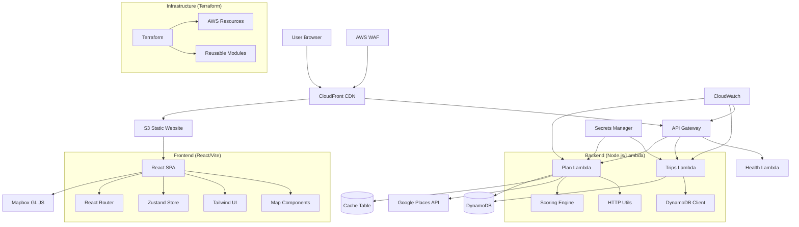

# Daylight Onboarding Guide

Welcome to Daylight! This guide will help you understand the system architecture, set up your development environment, and deploy to production.

## Table of Contents

- [System Architecture](#system-architecture)
- [Prerequisites](#prerequisites)
- [Development Setup](#development-setup)
- [Production Setup](#production-setup)
- [Environment Variables](#environment-variables)
- [Deployment Guide](#deployment-guide)
- [Troubleshooting](#troubleshooting)

## System Architecture

### High-Level Architecture Diagram



### Component Overview

| Component | Technology | Purpose | Key Features |
|-----------|------------|---------|--------------|
| **Frontend** | React + Vite + TypeScript | Single Page Application | Interactive maps, real-time search, responsive design |
| **CDN** | CloudFront | Content delivery | Global distribution, API proxying, caching |
| **API Gateway** | AWS API Gateway v2 (HTTP) | API routing & security | CORS, throttling, authentication |
| **Lambda Functions** | Node.js 20.x | Serverless compute | Auto-scaling, pay-per-use, stateless |
| **Database** | DynamoDB | NoSQL database | Serverless, auto-scaling, single-table design |
| **Secrets** | AWS Secrets Manager | API key storage | Encrypted secrets, automatic rotation |
| **Security** | AWS WAF | Web application firewall | Rate limiting, IP filtering, bot protection |

### Data Flow

1. **User Request** → CloudFront → S3 (static assets) or API Gateway (API calls)
2. **API Request** → API Gateway → Lambda function → DynamoDB/External APIs
3. **Search Flow** → Plan Lambda → Google Places API → Scoring Engine → Response
4. **Trip Management** → Trips Lambda → DynamoDB CRUD operations

## Prerequisites

### Required Software

- **Node.js** 20.x or later ([Download](https://nodejs.org/))
- **npm** 10.x or later (comes with Node.js)
- **Git** ([Download](https://git-scm.com/))
- **AWS CLI** v2 ([Installation Guide](https://docs.aws.amazon.com/cli/latest/userguide/getting-started-install.html))
- **Terraform** 1.6.0 or later ([Download](https://www.terraform.io/downloads))

### Required Accounts & Keys

- **AWS Account** with administrative access
- **Google Places API Key** ([Get API Key](https://developers.google.com/maps/documentation/places/web-service/get-api-key))
- **Mapbox Access Token** ([Get Token](https://account.mapbox.com/access-tokens/)) - Optional for maps

### AWS Permissions

Your AWS user/role needs these permissions:

- `CloudFormation` (full access for Terraform)
- `IAM` (create roles and policies)
- `Lambda` (create and manage functions)
- `DynamoDB` (create and manage tables)
- `API Gateway` (create and manage APIs)
- `S3` (create and manage buckets)
- `CloudFront` (create and manage distributions)
- `CloudWatch` (create and manage logs/alarms)
- `Secrets Manager` (create and manage secrets)
- `WAF` (create and manage web ACLs)

## Development Setup

### 1. Clone and Install

```bash
# Clone the repository
git clone https://github.com/your-org/daylight.git
cd daylight

# Install dependencies for all workspaces
npm install

# Build shared types
npm run build:shared
```

### 2. Environment Configuration

Create development environment files:

```bash
# Copy environment templates
cp env.dev.json.template env.dev.json
cp frontend/env.json.template frontend/env.json

# Edit with your configuration
```

### 3. Local Development

```bash
# Start frontend development server
cd frontend
npm run dev

# The app will be available at http://localhost:5173
```

### 4. Backend Testing

```bash
# Build backend
cd backend
npm run build

# Run tests
npm test

# Run integration tests (requires AWS setup)
npm run test:integration
```

## Production Setup

### 1. Configure AWS Credentials

```bash
# Configure AWS CLI with your credentials
aws configure

# Or use environment variables
export AWS_ACCESS_KEY_ID="your-key"
export AWS_SECRET_ACCESS_KEY="your-secret"
export AWS_DEFAULT_REGION="us-west-1"
```

### 2. Initialize Terraform

```bash
cd infra/terraform

# Initialize Terraform
terraform init

# Create workspace for environment
terraform workspace new dev  # or staging, prod
```

### 3. Configure Environment Variables

Edit the appropriate `.tfvars` file:

```bash
# For development
cp infra/env/dev.tfvars.template infra/env/dev.tfvars
# Edit dev.tfvars with your values

# For production
cp infra/env/prod.tfvars.template infra/env/prod.tfvars
# Edit prod.tfvars with your values
```

### 4. Deploy Infrastructure

```bash
# Plan deployment
terraform plan -var-file="../env/dev.tfvars"

# Apply changes
terraform apply -var-file="../env/dev.tfvars"

# Get output values
terraform output
```

### 5. Deploy Application Code

```bash
# Build and deploy backend
cd ../../backend
npm run build
npm run deploy:dev  # or deploy:prod

# Build and deploy frontend
cd ../frontend
npm run build
npm run deploy:dev  # or deploy:prod
```

## Environment Variables

### Development Environment

#### Frontend (`frontend/.env.local`)

```bash
# API Configuration
VITE_API_BASE=http://localhost:3000/api

# External Services
VITE_MAPBOX_TOKEN=pk.your_mapbox_token_here

# Feature Flags
VITE_ENABLE_DEBUG=true
VITE_ENABLE_MOCK_DATA=false

# Error Reporting
VITE_SENTRY_DSN=your_sentry_dsn_here
VITE_ENVIRONMENT=development
```

#### Backend Lambda Environment Variables

Automatically injected by Terraform:

```bash
# Database
TABLE_TRIPS=daylight-dev-trips
TABLE_CACHE=daylight-dev-cache

# Configuration
NODE_ENV=development
LOG_LEVEL=debug
CACHE_TTL=300

# External APIs (from Secrets Manager)
GOOGLE_PLACES_API_KEY=secret_reference
```

### Production Environment

#### Frontend (`frontend/.env.production`)

```bash
# API Configuration  
VITE_API_BASE=https://api.yourdomain.com

# External Services
VITE_MAPBOX_TOKEN=pk.your_production_mapbox_token_here

# Feature Flags
VITE_ENABLE_DEBUG=false
VITE_ENABLE_MOCK_DATA=false

# Error Reporting
VITE_SENTRY_DSN=your_production_sentry_dsn_here
VITE_ENVIRONMENT=production
```

#### Terraform Variables (`infra/env/prod.tfvars`)

```hcl
# Basic Configuration
project_name = "daylight"
environment  = "prod"
aws_region   = "us-west-1"
owner        = "daylight-team"

# Secrets
google_places_api_key = "your_google_api_key"
mapbox_access_token   = "pk.your_mapbox_token"

# Monitoring
alarm_email = "alerts@yourdomain.com"
create_alarm_topic = true

# Security
enable_waf = true
waf_rate_limit = 2000

# Performance
log_retention_days = 30
```

### Environment Variables Reference

| Variable | Environment | Required | Description | Example |
|----------|-------------|----------|-------------|---------|
| `VITE_API_BASE` | Frontend | ✅ | API endpoint URL | `https://api.example.com` |
| `VITE_MAPBOX_TOKEN` | Frontend | ❌ | Mapbox access token | `pk.eyJ1...` |
| `VITE_SENTRY_DSN` | Frontend | ❌ | Sentry error tracking | `https://...@sentry.io/...` |
| `TABLE_TRIPS` | Lambda | ✅ | DynamoDB trips table name | `daylight-dev-trips` |
| `TABLE_CACHE` | Lambda | ❌ | DynamoDB cache table name | `daylight-dev-cache` |
| `GOOGLE_PLACES_API_KEY` | Lambda | ✅ | Google Places API key | `AIza...` |
| `NODE_ENV` | Lambda | ✅ | Node.js environment | `development` |
| `LOG_LEVEL` | Lambda | ❌ | Logging level | `debug`, `info`, `warn`, `error` |

## Deployment Guide

### Automated Deployment (Recommended)

1. **Push to GitHub** - Triggers CI/CD pipeline
2. **GitHub Actions** builds and tests
3. **Terraform Apply** updates infrastructure
4. **Deploy Lambda** functions
5. **Deploy Frontend** to S3/CloudFront

### Manual Deployment

#### Backend Deployment

```bash
# Build Lambda packages
cd backend
npm run build

# Create deployment packages
npm run package

# Deploy with Terraform
cd ../infra/terraform
terraform apply -var-file="../env/dev.tfvars"
```

#### Frontend Deployment

```bash
# Build production bundle
cd frontend
npm run build

# Deploy to S3
aws s3 sync dist/ s3://your-bucket-name --delete

# Invalidate CloudFront cache
aws cloudfront create-invalidation \
  --distribution-id YOUR_DISTRIBUTION_ID \
  --paths "/*"
```

### Deployment Checklist

- [ ] Environment variables configured
- [ ] AWS credentials configured
- [ ] Terraform initialized
- [ ] Backend built and tested
- [ ] Frontend built and tested
- [ ] Infrastructure deployed
- [ ] Application code deployed
- [ ] Health checks passing
- [ ] Monitoring alerts configured

## Troubleshooting

### Common Issues

#### 1. Build Failures

**Problem**: TypeScript compilation errors

**Solution**:

```bash
# Clean and rebuild
npm run clean
npm install
npm run build
```

#### 2. API Gateway 502 Errors

**Problem**: Lambda function errors

**Solution**:

```bash
# Check CloudWatch logs
aws logs tail /aws/lambda/daylight-dev-plan --follow

# Check function configuration
aws lambda get-function --function-name daylight-dev-plan
```

#### 3. Frontend CORS Errors

**Problem**: API calls blocked by CORS policy

**Solution**: Check API Gateway CORS configuration in Terraform:

```hcl
cors_configuration = {
  allow_origins = ["https://yourdomain.com"]
  allow_methods = ["GET", "POST", "PUT", "DELETE", "OPTIONS"]
  allow_headers = ["*"]
}
```

#### 4. Environment Variable Issues

**Problem**: Variables not loaded correctly

**Solution**:

```bash
# Check Terraform outputs
terraform output

# Verify Lambda environment variables
aws lambda get-function-configuration \
  --function-name daylight-dev-plan \
  --query 'Environment.Variables'
```

### Getting Help

- **Documentation**: Check the `/docs` directory
- **Logs**: CloudWatch logs for detailed error information
- **Monitoring**: CloudWatch dashboards and alarms
- **Support**: Contact the development team

### Performance Optimization

1. **Frontend**: Enable gzip compression, optimize bundle size
2. **Backend**: Configure appropriate Lambda memory/timeout
3. **Database**: Use DynamoDB efficiently, enable caching
4. **CDN**: Configure appropriate cache headers
5. **Monitoring**: Set up performance alerts

---

For more detailed information, see:

- [Architecture Documentation](./architecture.md)
- [API Documentation](./api.md)
- [Development Guide](./development.md)
- [Deployment Guide](./deployment.md)
