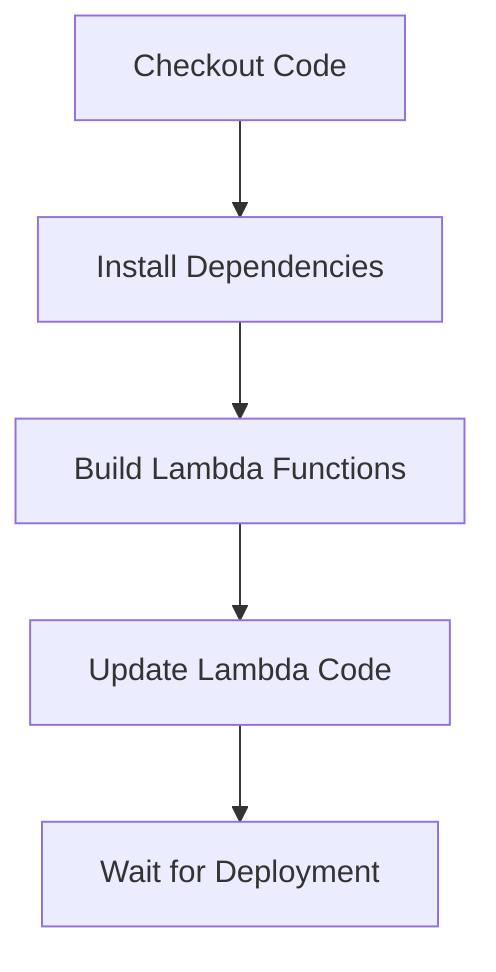
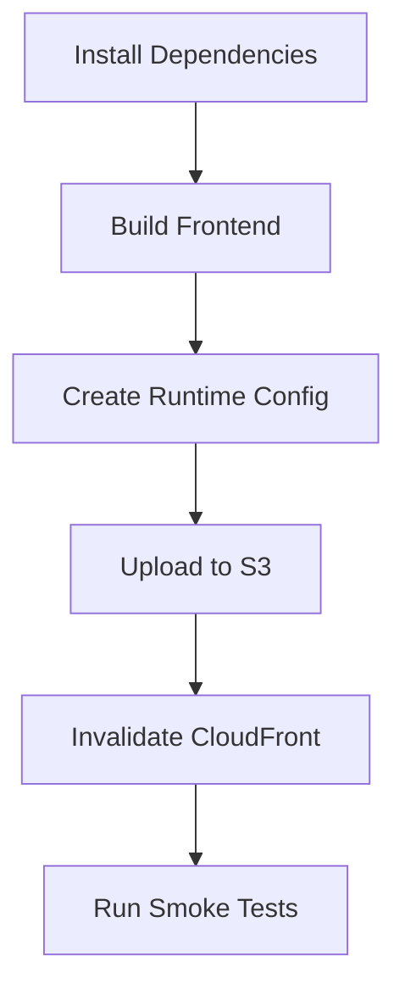

# GitHub Actions Deployment Setup

This document explains how to set up automated deployments for the Daylight application using GitHub Actions.

## Overview

The deployment workflow (`deploy-dev.yml`) automatically deploys to the dev environment when code is pushed to the `dev` branch. It performs the following steps:

1. **Backend Deployment**: Builds and updates Lambda functions
2. **Frontend Deployment**: Builds and syncs to S3
3. **Cache Invalidation**: Invalidates CloudFront cache
4. **Smoke Tests**: Verifies deployment success

## Required GitHub Secrets

Configure these secrets in your GitHub repository settings under **Settings > Secrets and variables > Actions**:

### AWS Credentials
```
AWS_ACCESS_KEY_ID           # AWS access key for deployment
AWS_SECRET_ACCESS_KEY       # AWS secret key for deployment
```

### Development Environment
```
DEV_API_BASE_URL           # API Gateway URL (e.g., https://abc123.execute-api.us-west-1.amazonaws.com)
DEV_S3_BUCKET_NAME         # S3 bucket name (e.g., daylight-frontend-dev)
DEV_CLOUDFRONT_DISTRIBUTION_ID  # CloudFront distribution ID (e.g., E1234567890ABC)
DEV_DOMAIN_NAME            # Frontend domain (e.g., dev.daylight.app or CloudFront domain)
```

### Application Secrets
```
VITE_MAPBOX_TOKEN          # Mapbox access token for map functionality
```

## AWS IAM Permissions

The AWS user/role used for deployment needs the following permissions:

### Lambda Permissions
```json
{
  "Version": "2012-10-17",
  "Statement": [
    {
      "Effect": "Allow",
      "Action": [
        "lambda:UpdateFunctionCode",
        "lambda:GetFunction",
        "lambda:PublishVersion"
      ],
      "Resource": [
        "arn:aws:lambda:us-west-1:*:function:daylight-trips-dev",
        "arn:aws:lambda:us-west-1:*:function:daylight-plan-dev"
      ]
    }
  ]
}
```

### S3 Permissions
```json
{
  "Version": "2012-10-17",
  "Statement": [
    {
      "Effect": "Allow",
      "Action": [
        "s3:GetObject",
        "s3:PutObject",
        "s3:DeleteObject",
        "s3:ListBucket"
      ],
      "Resource": [
        "arn:aws:s3:::daylight-frontend-dev",
        "arn:aws:s3:::daylight-frontend-dev/*"
      ]
    }
  ]
}
```

### CloudFront Permissions
```json
{
  "Version": "2012-10-17",
  "Statement": [
    {
      "Effect": "Allow",
      "Action": [
        "cloudfront:CreateInvalidation",
        "cloudfront:GetInvalidation",
        "cloudfront:ListInvalidations"
      ],
      "Resource": "arn:aws:cloudfront::*:distribution/E1234567890ABC"
    }
  ]
}
```

## Setting Up Secrets

### 1. AWS Credentials
Create an IAM user with the permissions above:
```bash
# Create IAM user
aws iam create-user --user-name github-actions-daylight

# Create access key
aws iam create-access-key --user-name github-actions-daylight
```

### 2. Get Resource Identifiers
Use Terraform outputs to get the required values:
```bash
cd infra/terraform
terraform output
```

Expected outputs:
```
api_base_url = "https://abc123.execute-api.us-west-1.amazonaws.com"
cloudfront_distribution_id = "E1234567890ABC"
s3_bucket_name = "daylight-frontend-dev"
website_url = "https://d1234567890.cloudfront.net"
```

### 3. Configure in GitHub
1. Go to your repository on GitHub
2. Navigate to **Settings > Secrets and variables > Actions**
3. Click **New repository secret**
4. Add each secret with the values from your AWS resources

## Workflow Triggers

The deployment workflow runs when:
- Code is pushed to the `dev` branch
- Changes are made to:
  - `frontend/**`
  - `backend/**`
  - `infra/**`
  - `.github/workflows/deploy-dev.yml`

## Manual Deployment

To trigger a deployment manually:
1. Go to **Actions** tab in GitHub
2. Select **Deploy to Dev** workflow
3. Click **Run workflow**
4. Select the `dev` branch
5. Click **Run workflow**

## Monitoring Deployments

### GitHub Actions
- View deployment logs in the **Actions** tab
- Each step is logged with detailed output
- Failed deployments will show error details

### AWS CloudWatch
Monitor Lambda function health:
```bash
# Check Lambda logs
aws logs describe-log-groups --log-group-name-prefix "/aws/lambda/daylight"

# View recent logs
aws logs filter-log-events \
  --log-group-name "/aws/lambda/daylight-trips-dev" \
  --start-time $(date -d '1 hour ago' +%s)000
```

### Frontend Health
Test the deployed application:
```bash
# Test frontend
curl -I https://your-domain.com/

# Test API through CloudFront
curl https://your-domain.com/api/health

# Check runtime config
curl https://your-domain.com/env.json
```

## Deployment Process

### 1. Backend Deployment


### 2. Frontend Deployment


## Rollback Strategy

### Automatic Rollback
The workflow includes smoke tests that will fail the deployment if:
- API health check fails
- Frontend health check fails

### Manual Rollback
If you need to rollback after a successful deployment:

1. **Backend Rollback**:
```bash
# Get previous version
aws lambda list-versions-by-function --function-name daylight-trips-dev

# Rollback to previous version
aws lambda update-alias \
  --function-name daylight-trips-dev \
  --name LIVE \
  --function-version $PREVIOUS_VERSION
```

2. **Frontend Rollback**:
```bash
# Redeploy previous commit
git checkout dev
git reset --hard $PREVIOUS_COMMIT_SHA
git push --force-with-lease origin dev
```

## Troubleshooting

### Common Issues

1. **Lambda Update Failed**
   - Check function names match Terraform outputs
   - Verify IAM permissions
   - Ensure function exists

2. **S3 Upload Failed**
   - Check bucket name and permissions
   - Verify bucket exists and is accessible
   - Check for bucket policy conflicts

3. **CloudFront Invalidation Failed**
   - Verify distribution ID is correct
   - Check CloudFront permissions
   - Ensure distribution is deployed

4. **Smoke Tests Failed**
   - Check if deployment is still propagating
   - Verify API Gateway endpoints
   - Check CloudFront distribution status

### Debug Commands
```bash
# Check Lambda function status
aws lambda get-function --function-name daylight-trips-dev

# Check S3 bucket contents
aws s3 ls s3://daylight-frontend-dev/

# Check CloudFront distribution
aws cloudfront get-distribution --id E1234567890ABC

# Test API directly
curl -v https://api-id.execute-api.us-west-1.amazonaws.com/health
```

## Production Deployment

To set up production deployment:

1. Create `deploy-prod.yml` workflow
2. Add production secrets (`PROD_*` variants)
3. Configure production IAM permissions
4. Set up branch protection for `main` branch
5. Require pull request reviews

Example production secrets:
```
PROD_API_BASE_URL
PROD_S3_BUCKET_NAME
PROD_CLOUDFRONT_DISTRIBUTION_ID
PROD_DOMAIN_NAME
```

## Security Best Practices

1. **Least Privilege**: IAM user has minimal required permissions
2. **Secret Rotation**: Rotate AWS access keys regularly
3. **Branch Protection**: Protect main branch, require reviews
4. **Environment Separation**: Separate dev/prod resources
5. **Audit Logging**: Enable CloudTrail for deployment auditing
