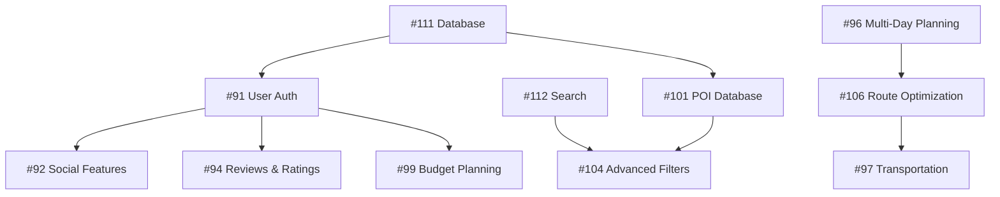

# GitHub Issues Summary: Feature Gaps & Infrastructure Improvements

## 📊 Overview
Created 30 comprehensive GitHub issues (91-120) based on competitive analysis against market leaders like Google Travel, TripIt, Foursquare, Yelp, and Citymapper.

## 🎯 Feature Issues (91-110) - 20 Major Gaps

### High Priority (8 issues)
- **#91** 🔐 User Authentication & Profile System
- **#94** ⭐ Reviews & Ratings System  
- **#95** 📱 Offline Mode & Data Sync
- **#96** 🗓️ Multi-Day Itinerary Planning
- **#97** 🚌 Transportation Integration & Multi-Modal Planning
- **#101** 🏪 Rich POI Database & Local Discovery
- **#104** 🔍 Advanced Filters & Search
- **#106** 🛣️ Route Optimization & Multi-Stop Planning

### Medium Priority (10 issues)
- **#92** 👥 Social Features & Collaboration
- **#93** 📸 Photo Integration & Visual Documentation
- **#98** 🏨 Booking Integration & Reservations
- **#99** 💰 Budget Planning & Expense Tracking
- **#100** 🔔 Real-time Notifications & Alerts
- **#102** 🤖 Personalized ML Recommendations
- **#105** 🎃 Enhanced Seasonal & Event-Aware Planning
- **#107** 👨‍👩‍👧‍👦 Group Planning & Collaboration
- **#108** 🔗 Integration Ecosystem & Third-Party Apps
- **#109** ♿ Accessibility Features & Inclusive Planning

### Low Priority (2 issues)
- **#103** 📰 Editorial Content & Curated Guides
- **#110** 🥽 AR/Visual Search & Modern Discovery

## 🏗️ Infrastructure Issues (111-120) - 10 Major Improvements

### High Priority (3 issues)
- **#111** 🗄️ Production Database Layer & Data Architecture
- **#112** 🔍 Search Infrastructure & Geospatial Indexing
- **#114** 🛡️ API Management & Rate Limiting
- **#119** 🔐 Advanced Security & Compliance Framework

### Medium Priority (4 issues)
- **#113** 🌐 CDN & Global Asset Optimization
- **#115** 📊 User Analytics & Behavioral Tracking
- **#116** ⚡ Real-time Data Pipeline & Event Processing
- **#120** 🛡️ Content Moderation & Safety Platform

### Low Priority (3 issues)
- **#117** 🤖 Machine Learning Platform & Model Infrastructure
- **#118** 📈 Data Warehouse & Business Intelligence

## 🎯 Strategic Roadmap Recommendations

### Phase 1: Foundation (Issues 91, 111, 112, 119)
**Timeline: 2-3 months**
- User Authentication & Profiles (#91)
- Production Database Layer (#111)
- Search Infrastructure (#112)
- Advanced Security Framework (#119)

**Impact**: Enables user data, secure operations, and fast POI discovery

### Phase 2: Core Travel Features (Issues 94, 95, 96, 97, 101)
**Timeline: 3-4 months**
- Reviews & Ratings (#94)
- Offline Mode (#95)
- Multi-Day Planning (#96)
- Transportation Integration (#97)  
- Rich POI Database (#101)

**Impact**: Competitive parity with major travel apps

### Phase 3: Personalization & Social (Issues 92, 102, 104, 106)
**Timeline: 2-3 months**
- Social Features (#92)
- ML Recommendations (#102)
- Advanced Filters (#104)
- Route Optimization (#106)

**Impact**: Differentiation and user engagement

### Phase 4: Advanced Features (Remaining issues)
**Timeline: Ongoing**
- Booking integration, budget tracking, accessibility
- Advanced infrastructure and analytics
- Future-forward features (AR, content moderation)

## 📈 Business Impact Assessment

### High-Impact Features (Revenue & Retention)
1. **User Authentication** - Enables data persistence and personalization
2. **Booking Integration** - Direct revenue opportunity
3. **Multi-Day Planning** - Core value proposition vs. competitors
4. **Offline Mode** - Essential for travel app reliability
5. **Reviews & Ratings** - Trust and content quality

### Competitive Positioning
- **Current**: Basic location-based suggestions with weather/events
- **With Roadmap**: Comprehensive travel platform competitive with Google Travel/TripIt
- **Differentiation**: Real-time optimization + local discovery + social features

### Technical Debt Priority
1. Database infrastructure (#111) - Foundational requirement
2. Search infrastructure (#112) - Performance bottleneck
3. Security framework (#119) - Enterprise readiness
4. API management (#114) - Scalability requirement

## 🔗 Issue Dependencies

## 📊 Resource Requirements

### Development Team Scaling
- **Phase 1**: 3-4 senior developers
- **Phase 2**: 5-6 developers + UX designer
- **Phase 3**: 6-8 developers + ML engineer
- **Phase 4**: Full product team (10-12 people)

### Infrastructure Costs (Estimated Monthly)
- **Phase 1**: $500-1000 (database, auth services)
- **Phase 2**: $2000-5000 (search, storage, CDN)
- **Phase 3**: $5000-10000 (ML, real-time processing)
- **Phase 4**: $10000+ (full production scale)

---

**All issues created with detailed acceptance criteria, technical requirements, and proper labeling for project management.**

*This roadmap transforms Daylight from a basic POC to a comprehensive travel platform competitive with market leaders.*
